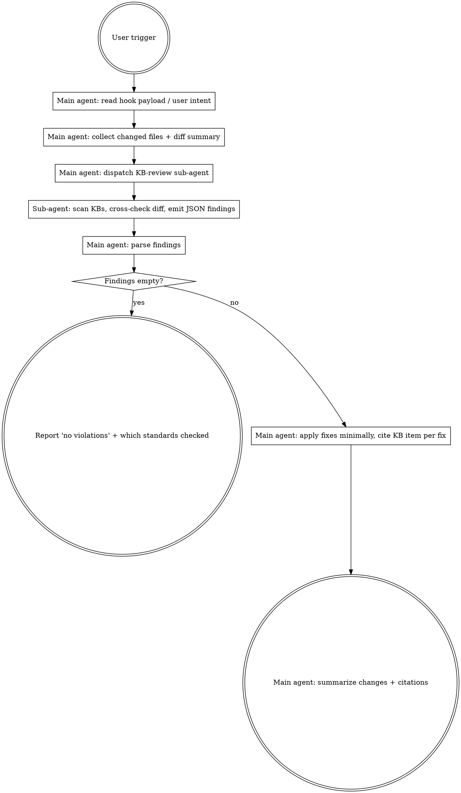

# KB Code Review

Convention-compliance code review driven entirely by the Knowledger knowledge bases. The main agent MUST NOT do the review itself — it dispatches a **KB-review sub-agent**, waits for the sub-agent's structured findings, then applies the fixes.

## When To Invoke

- The user asks explicitly for a convention/standard review against the KB (see `triggers`).
- Skip only if:
  - There are no tracked/staged changes in the repo (nothing to review).
  - The user says "skip KB review" / "不用查知识库" for this turn.
  - `.knowledger/skip-code-review` exists in the project.

If no KBs are configured (`list_knowledge_bases` returns empty), report "no knowledge bases configured — nothing to review against" and finish without further action.

## The Contract



## Step 1 — Main Agent Preparation

Before dispatching the sub-agent, gather (silently, no narration):

1. The list of tracked+staged changed files. Run `git status --porcelain` and filter out `??`/`!!`.
2. The diff you will hand the sub-agent:
   - `git diff HEAD -- <changed files>`
   - `git diff --cached -- <changed files>`
   Keep it capped at ~500 lines total; if larger, chunk by file and dispatch multiple sub-agents in parallel, one per file group.
3. Any language/framework hints from the changed paths (e.g. `.go` under `internal/`, `.tsx` under `web/`) — these get passed to the sub-agent so it can bias which KB items are relevant.

## Step 2 — Dispatch the KB-Review Sub-Agent

Use the `Agent` tool (subagent_type `general-purpose`, or `Explore` when only read access is needed — this task needs KB tool calls, so `general-purpose` is correct). The sub-agent's **only** job is retrieval + comparison + structured output. It MUST NOT edit code, invoke other skills, or continue the user's task.

Sub-agent prompt template (fill in the bracketed parts):

```
You are a KB-review sub-agent. Your ONLY job: cross-check the provided git diff against the project's knowledger knowledge bases and return structured findings. You must not edit files, invoke other skills, answer unrelated questions, or continue the user's task.

Task classification: coding task (over-inclusion — 宁烂勿缺).

Changed files:
[bulleted file list]

Language / framework hints:
[hint list, or "none"]

Diff (truncated where noted):
```diff
[diff contents]
```

Protocol:
1. Call `list_knowledge_bases` — get every KB (id, name, scope).
2. For each KB, call `list_knowledge_items` and collect every id + title + tags.
3. For every item whose title/tags could plausibly cover: coding standards, code review checklists, style rules, library usage, error handling, logging, security, testing, concurrency, API design, naming, project conventions, or anything touched by the changed files — call `get_knowledge_item` and pull the full content. Threshold is ≥1% relevance; over-include.
4. For each retrieved item, walk the diff hunks and identify concrete violations. A violation must be traceable to a specific sentence/rule in the KB item — no generic advice, no invented rules.
5. Never read KB files directly with Read/grep/cat — only through knowledger MCP tools.

Return ONLY a single JSON object with this schema — no prose, no markdown fences around the JSON:

{
  "kbs_checked": [{"id": "...", "scope": "...", "items_scanned": N, "items_pulled": M}],
  "conventions_considered": [
    {"kb_id": "...", "item_id": "...", "title": "...", "why_relevant": "one line"}
  ],
  "findings": [
    {
      "path": "path/to/file",
      "line": 123,
      "severity": "must-fix" | "should-fix" | "nit",
      "kb_id": "...",
      "item_id": "...",
      "item_title": "...",
      "rule_quote": "verbatim sentence(s) from the KB item that this finding traces to",
      "problem": "what the current code does that violates the rule",
      "suggested_fix": "concrete edit — enough for the main agent to apply directly"
    }
  ],
  "notes": "optional — anything the main agent should know (e.g. 'no items covered file X, so it was not reviewed'). Omit if nothing to say."
}

If no KBs are configured, return `{"kbs_checked": [], "conventions_considered": [], "findings": []}` and stop.
If items exist but none apply, return findings=[] with `conventions_considered` filled in so the main agent can tell the user which standards were checked.
```

Dispatch the sub-agent, wait for it to return. Do not start any other work while waiting.

## Step 3 — Apply Findings

Parse the sub-agent's JSON. Then:

- If `findings` is empty and `conventions_considered` is non-empty → tell the user "No convention violations found" and list the standards that were checked (KB item titles).
- If `findings` is empty and `conventions_considered` is empty → tell the user "No relevant knowledge items exist for the changed code" and stop.
- If `findings` is non-empty:
  1. Group by file. For each file, apply the fixes with `Edit`/`Write` — smallest change that satisfies the cited rule.
  2. If two findings conflict, or a `suggested_fix` disagrees with the user's original intent, STOP and surface the conflict to the user before editing.
  3. Do NOT expand scope. Only touch lines the finding points to (plus the minimum context needed for the edit to compile).
  4. After edits, run the project's fast checks if trivially available (`go vet`, `tsc --noEmit`, etc.) — but do not run heavy test suites unless the user asks.

## Step 4 — Report

One short summary block back to the user:

- Files reviewed and standards checked (item titles, one line each).
- Fixes applied — `path:line — <problem>` with the cited KB item id + title.
- Anything left unresolved (conflicts, ambiguous rules, out-of-scope findings).

Keep it terse. The diff is the record — do not repeat it.

## Hard Rules

- **Never** perform the review inline in the main agent. Always dispatch the sub-agent, even for a one-file change.
- **Never** invent findings. If the sub-agent returns nothing, that's the answer.
- **Never** read KB files with Read/grep/cat — only via `list_knowledge_bases`, `list_knowledge_items`, `get_knowledge_item`.
- **Never** widen the fix beyond what the cited rule requires.
- **Never** loop: once this skill has run for the current user-triggered review, do not re-invoke it in the same turn.
